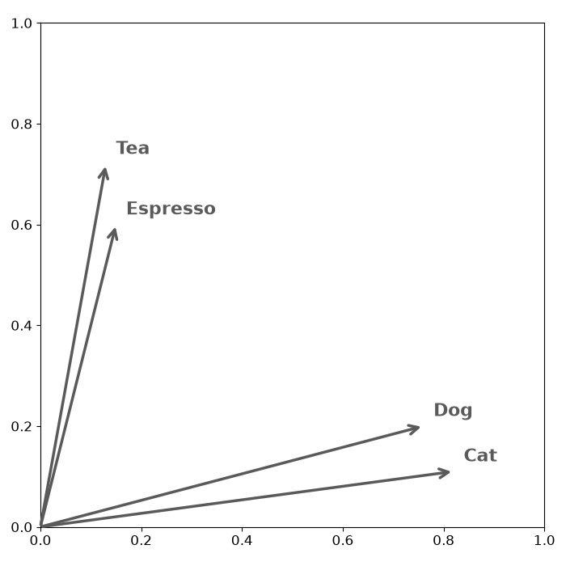
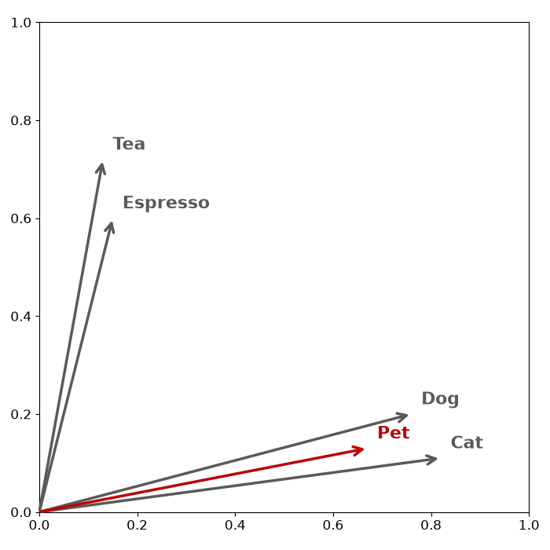
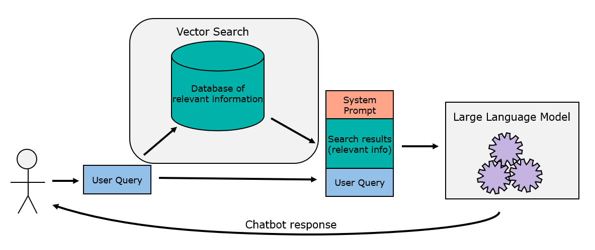

# Brief Introduction to Vector Search 

Vector search is a procedure that allows data retrieval of similar information without needing to exactly match any data, meaning that searches can identify similar concepts without requiring specific features (like keywords) to match. 

For simplicity, this explanation will assume the subject is text, but vector search is also possible with other form of data (like audio and images). 

The key part to vector search is encoding the meaning of the subject into mathematical vectors (arrays of numbers representing a point in multi-dimensional space). A pre-trained model is used to encode the semantic meaning of the subject into vectors. Take a look at a basic example: 

### Worked example

There are 4 subject words: 
- *Cat*
- *Dog* 
- *Espresso* 
- *Tea*

Imagine you wanted to find information about *Pets* in the database, humans can instinctively look at the words and say *Cat* and *Dog* are the most relevant words in our dataset to the query, but a standard keyword query would never find this. 

Vector search is an alternative that gets around this limitation. A pre-trained machine learning model transforms data (text in this case) into embeddings, or vectors. 

The subject words may be given the following vectors :
- *Cat* - [0.82, 0.11]
- *Dog* - [0.90, 0.15]
- *Espresso* - [0.11, 0.65]
- *Tea* - [0.13, 0.72]

If you were to plot these (made-up) numbers on a graph, it might look as follows: 

The words that mean semantically similar things (e.g. hot drinks) are close to each other in vector space. That way, if the same embedding method is used on the query term, *Pets*, it would appear close to the *Dog* and *Cat*: 

The beauty of this approach is that vector maths is quick and efficient. The mathematical operations, vector cosine and vector dot product can measure the similarity of vectors. 

### Scaling Up

While the example above details plotting each word on a two dimensional plane, real use-cases use much larger vectors. Small language models may use 386 dimensions, while larger embedding models can scale up to thousands of dimensions.

Each of these dimensions describes some abstract feature of the data, which the black-box model extracts, but are not understandable individually. 

As well as scaling in terms of number of vectors, the retrieval method also scales with number of words. In the above example each word has a vector and is being searched against. 

In real life, sentences or paragraphs are embedded into vectors meaning a greater meaning can be encoded. Normally, long form text (like documents or articles) are broken down into chunks before being embedded into vectors. 

The ideal scenario is that each chunk represents a single block of meaning. For example, an employee handbook might be broken down into individual chunks about parking, vacation allowance and working hours. That way, a question about parking would match the one chunk about parking. In reality, chunks are tuneable parameters which determine retrieval efficiency. They are generally determined based on automatic chunking procedures, aiming to break down by paragraph or if thats too long, by sentence. 

### Vector Search with InterSystems IRIS

InterSystems IRIS supports `VECTOR` datatypes in its database, as well as providing `VECTOR_COSINE()` and `VECTOR_DOT_PRODUCT()` procedures to perform the vector calculations. The embedded vectors can appear directly alongside the raw text counterparts, meaning vector search and retrieval is straightforward. 

This is detailed in the [4.1-vector-search](../4-vector-search/4.1-vector-search.ipynb) tutorial.

### Retrieval Augmented Generation

Retrieval Augmented Generation (RAG) is a popular method to turn generalized Large Language Models (like chatGPT) into subject specialists, with up-to-date and verified information.  

The idea is simple, when a user sends a query, this prompt is first used to search a database of relevant information. The results of the database search is combined with the user's query and sent to the LLM. This is combined with a system prompt, instructing the LLM to use only the information provided in the search results. 

This simple architecture can create a chatbot which has all the relevant and up-to-date information without requiring expensive fine-tuning or re-training. This architecture also allows the data in the database to be kept private, i.e. not used to train the model. 

### The Agent Era

The RAG architecture has largely been succeeded by agentic methods. Rather performing the search automatically and sending the results with the initial prompt to the LLM, instead you can give the LLM a tool to run the search autonomously. 

Vector Search is still a vital retrieval tool, and allowing the LLM to perform the retrieval autonomously extends this value. Agents can search, parse the response, and refine the query and research, or search multiple times in parallel to ensure all the important data is retrieved. 

Examples of using Vector Search with AI agents are shown in [section 5](../5-ai/5.1-agents-and-tools.ipynb).

### Considerations
There are several things that can affect the performance of the vector search:
- The choice of Embedding Model will affect the quality of the vector search. Some embedding models have been created for specific types of text, for example for use with medical or scientific information. This improvement comes at a cost, more specific or larger models tend to be slower to perform the embedding. 
- The Number of Dimensions in our vector will affect both quality and performance. Dimensionality is generally decided by the embedding model. More dimensions will lead to better search results but will slow performance.
- A vector search may be improved by combination with traditional keyword searches in a hybrid approach.
- Documents are often split into chunks before a vector search which improves granularity and relevance, improving the search quality.

#### More info

This was a very brief introduction, but for more information you can check out some of the following links: 
- What is RAG? https://youtu.be/u47GtXwePms
- Code-to-Care video series https://www.youtube.com/playlist?list=PLG6AFWumOYWhyM8T2Doye4sAA-kOH6-YG
- https://collabnix.com/rag-retrieval-augmented-generation-the-complete-guide-to-building-intelligent-ai-systems-in-2025/
- https://github.com/Danielskry/Awesome-RAG