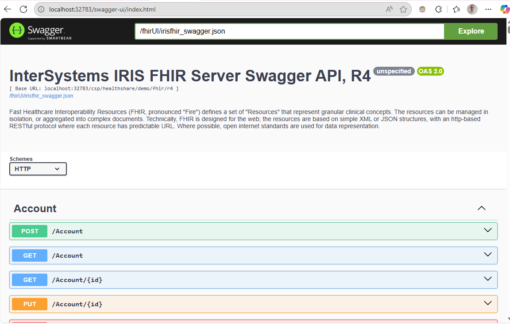
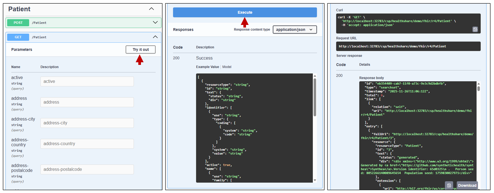

## Viewing the FHIR Specification with Swagger

If you have set up the FHIR server with the template found in the `docker-iris-fhir`, this will also install a Swagger-UI. [Swagger](https://swagger.io/) is a REST API tool that works with standard API specifications. Swagger UI is a nice user interface to see the REST Methods and parameters, making it easy to visualize and test REST Endpoints. This UI should be available at: http://localhost:32783/fhir/swagger-ui/index.html. 

Clicking any one of these methods can show the search parameters and expected response for the method. To test one of the methods, you can click `Try it out`, then add the parameters, scroll down and click `Execute`. This will perform a `curl` request to the endpoint, and after a few seconds, will show the response body below. If it's a GET request, the response will be a bundle of FHIR resources as requested.

